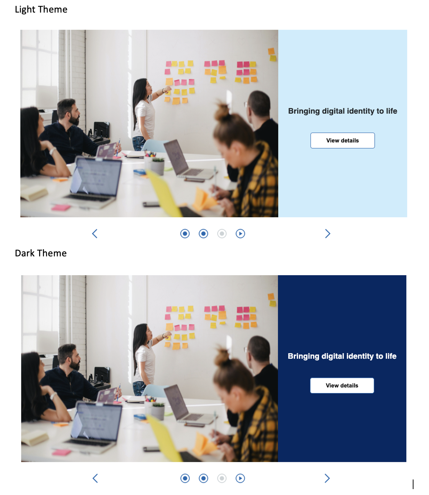
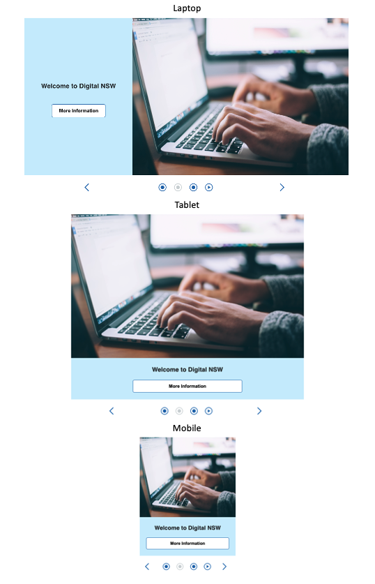

# Digital NSW Work Task - Carousel Component


## Table of Content

1. [Planning and building](#planning-and-building)

   1.1 [Evaluating the need for carousel component](#evaluating-the-need-for-carousel-component)

   1.2 [Planning for building the component](#planning-for-building-the-component)

2. [Proposed Design](#proposed-design)

   2.1 [Theme styles](#theme-styles)

   2.2 [Autoplay](#autoplay)

   2.3 [Play speed](#play-speed)

   2.4 [Content layout](#content-layout)

   2.5 [Responsive design](#responsive-design)

3. [Accessibility](#accessibility)
4. [Testing](#Testing)
5. [Storybook](#storybook)
6. [Installation](#installation)

## Planning and building

##### Evaluating the need for carousel component

Upon reviewing the existing design system components, I didn't find the carousel component in the current design system. Recognizing the potential to enhance user experience, I have come up with the idea of building this component. I hope the carousel component can bring more dynanmic, attractive and interactions with users for the digital NSW website.

##### Planning for building the component

Three main objects for Carousel component is to achieve:

- Extensibility
- Consistency
- User-friendly
- Responsive

For the extensibility: In developing this component, my intention was to create a versatile and expandable solution. The component should be that provides for future growth based on systems design principle. The component should has the quality of being able to add new functinality and capabilities.

For the consistency: To ensure a cohesive visual experience, the carousel need to seamlessly integrate with the existing website styles. By harmonizing background colors, font styles, and layout, the component would smatch the styles of the exisiting website, and it should looks coherent across the other different elements. Then it will deliver a unified and high-quality user experience.

For user-friendly: Catering to users of varying ages and abilities, including seniors and individuals with visual or hearing impairments, the carousel was designed with the objective of simplicity. It was crucial to strike a balance between functionality and ease of use, enabling effortless navigation and interaction for all user groups.

For Responsive perspective: Recognizing the diverse range of devices utilized by website visitors, I prioritized responsive design principles. By ensuring the carousel's adaptability across different screen sizes, such as mobile, tablet, and laptop, users could enjoy a consistently optimal experience regardless of their chosen device.

## Proposed Design

##### Theme styles

In an effort to enhance user satisfaction, I introduced multiple theme variations for the carousel component, including dark and light modes. Acknowledging that some users may experience eye strain with a light background, the inclusion of a dark theme caters to their preferences. This flexibility empowers users to switch between themes based on their individual comfort and visual preferences.


##### Autoplay

To infuse dynamism into the website, I incorporated autoplay functionality within the carousel. However, based on the WACG guidelines, reference on [WCAG 2.1 Guidelines Explained with Examples](#https://medium.com/c2-group/wcag-2-1-guidelines-explained-with-examples-5c7c5d8b69eb)

> Some users might experience distraction or nausea from animated or moving content. If scrolling through a page causing elements to move or scrolling with backgrounds that move at a different rate than the foreground, there must be an option for the user to turn these off or the user may enable reduce motion preferences.


so I also developed the pause button for an option for user to choose. This optional feature allows users to disable autoplay if they find it distracting or uncomfortable, ensuring a personalized and inclusive browsing experience.

##### Play speed

To adhere to WCAG standards, I implemented play speed control, enabling users to adjust the speed at which carousel slides transition.
Based on the reference on [Web Content Accessibility checklist](#https://www.w3.org/TR/WCAG21/)

> For any auto-updating information that (1) starts automatically and (2) is presented in parallel with other content, there is a mechanism for the user to pause, stop, or hide it or to control the frequency of the update unless the auto-updating is part of an activity where it is essential.

Therefore, by inputting desired intervals, users can customize the timing to their preference. The default setting of 2 seconds per slide can be easily modified, empowering users to optimize their carousel experience.

##### Content layout

Flexibility in content layout was a paramount consideration during development. Users now have the freedom to choose whether the image is positioned on the left or right side of the carousel. This feature accommodates individual reading preferences, with some users favoring text placement on the left-hand side and others on the right-hand side.

##### Responsive design

Recognizing the importance of accessibility, I dedicated effort to ensure responsive design across various screen sizes. By implementing the component's responsiveness, users can access and enjoy the carousel on devices of all types, ranging from mobiles and tablets to laptops. This comprehensive approach ensures an optimal user experience, particularly for individuals with low vision who frequently utilize mobile devices.
The following figure is the overview of the component across different screen size.

<p align="center">
  
</p>

## Accessibility

##### Screen reader

##### Keyboard control

As [John Gruber] writes on the [Markdown site][df1]

> The overriding design goal for Markdown's
> formatting syntax is to make it as readable
> as possible. The idea is that a
> Markdown-formatted document should be
> publishable as-is, as plain text, without
> looking like it's been marked up with tags
> or formatting instructions.

This text you see here is \*actually- written in Markdown! To get a feel
for Markdown's syntax, type some text into the left window and
watch the results in the right.

## Testing

To run the test:

```sh
npm run test
```

## Storybook

To view the component in storybook:

```sh
npm run storybook
```

## Installation

This application requires [Npm](https://www.npmjs.com/) to run.

Install the dependencies and start the application.

```sh
npm i
npm start
```

To start Storybook.

```sh
npm run stroybook
```

## Learn More
